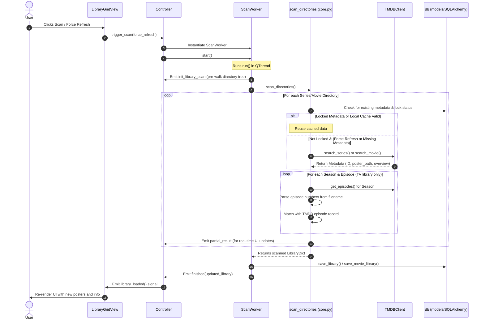
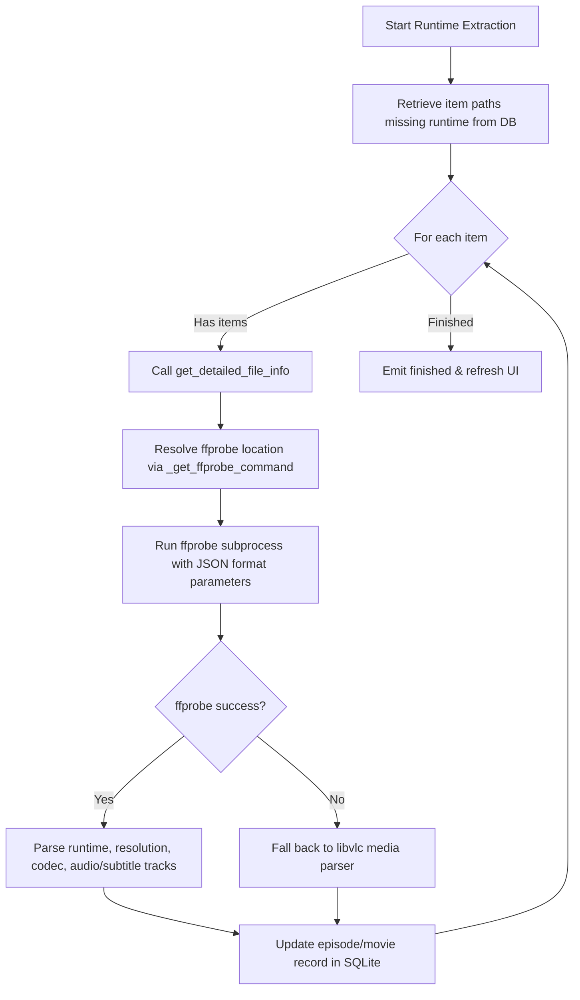
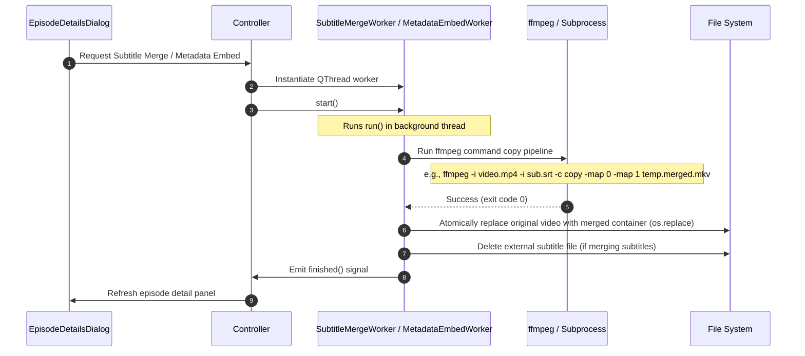
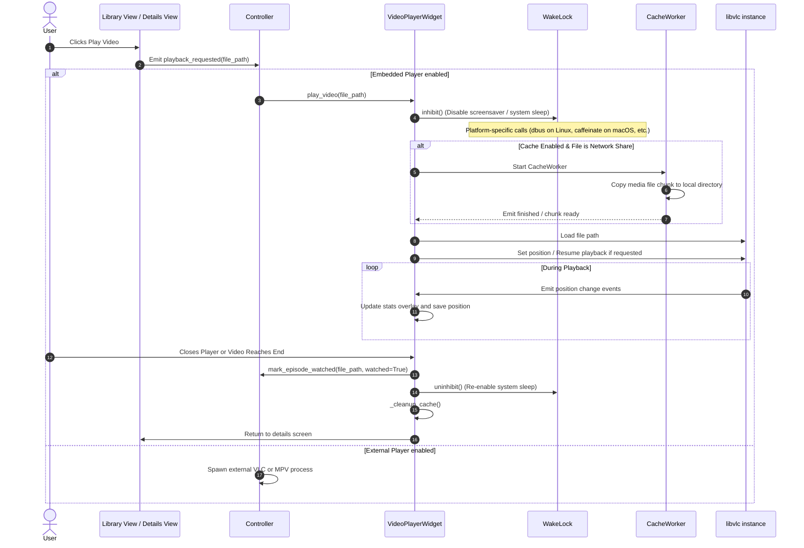
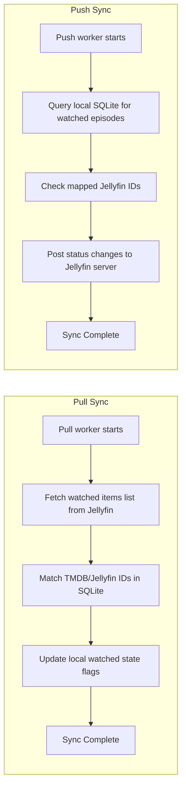

# Logic Flows and Codepaths

This document details the main logic flows and execution paths within the `lan-streamer` codebase, using Mermaid.js diagrams to visualize the control flow.

---

## 1. Library Scanning Flow

The library scanning flow updates the local SQLite database with information about files in the configured media directories, linking them to TMDB metadata.

### Mermaid Diagram

### Steps in the Flow

1. **Triggering the Scan**: The user requests a scan from the UI (e.g. `LibraryGridView` or `SettingsDialog`).
2. **Worker Instantiation**: The `Controller` instantiates a `ScanWorker` (which inherits from `QThread`) to run the scanning loop in the background and prevent UI lockups.
3. **Directory Pre-Walk**: The worker calls `discover_single_library_tree` to pre-walk folders. It emits `init_library_scan` to initialize the `LibraryScanProgressBar` and `ScanProgressTree`.
4. **Metadata Resolution & Matching**:
   - `scan_directories` walks each subdirectory.
   - If a series has `locked_metadata=True`, scanning is skipped, and the existing entry is preserved.
   - Otherwise, `TMDBClient` is queried to match the folder name with online records.
   - In TV libraries, season folders are scanned for video files, matched with TMDB episode numbers via regex (`_parse_episode_number`), and metadata (name, air date, runtime) is gathered.
5. **Database Updates**: Scanned records are written to the database using SQLAlchemy sessions in `db.save_library()` or `db.save_movie_library()`.
6. **UI Refresh**: Once finished, the worker emits the `finished` signal, and the `Controller` triggers `library_loaded` to update view templates.

---

## 2. Technical Metadata Extraction and Subtitle Merging

When files are scanned, they may have missing runtimes, resolutions, or subtitles. Background processes extract technical info and run `ffmpeg` to embed assets.

### Mermaid Diagram

### Subtitle and Metadata Embedding Sequence

### Technical Details

- **`ffprobe` Resolution**: The `_get_ffprobe_command` helper in `src/lan_streamer/scanner/runtime.py` checks the system path and falls back to macOS homebrew paths (`/opt/homebrew/bin/ffprobe`) or Unix standard bin paths.
- **FFmpeg copy pipelines**: To avoid re-encoding, technical workers always invoke ffmpeg using the `-c copy` flag. This allows swift embedding of tracks and metadata tags without consuming high CPU cycles or degrading video quality.

---

## 3. Media Playback & Wakelocks

This flow manages the lifecycle of video playback, ensuring files are cached locally if needed, system sleep is inhibited, and playback positions are tracked.

### Mermaid Diagram

### Steps in the Flow

1. **Playback Request**: The `Controller` listens to view clicks and routes the selected video path.
2. **Wakelock Activation**: To prevent screensavers or system sleep from interrupting movies, `WakeLock.inhibit()` is called. It supports Linux (`org.freedesktop.ScreenSaver` dbus), Windows (`SetThreadExecutionState`), and macOS (`caffeinate` sub-processes).
3. **Local Caching**: The `CacheWorker` runs in a separate thread to copy media files locally to speed up seek times when playing files over high-latency networks (e.g. SMB/NFS mounts).
4. **VLC Playback Control**: Playback state, track selection, volume, and playback speed are controlled via libvlc.
5. **Watched State Sync**: When a threshold is met or the video ends, the local DB updates `watched=True` and resets the saved resume position.

---

## 4. Jellyfin Watch History Sync (Push/Pull)

Syncs local watch status with a central Jellyfin server.

### Mermaid Diagram

### Synchronizing Rules

- **Pull Process**: `JellyfinPullWorker` calls `fetch_watched_episodes` which queries the Jellyfin user library database, resolves the items using local DB models, and marks matches as watched.
- **Push Process**: `JellyfinPushWorker` identifies which items were watched locally but remain unwatched on Jellyfin, sending watch/unwatch requests through Jellyfin HTTP APIs.
