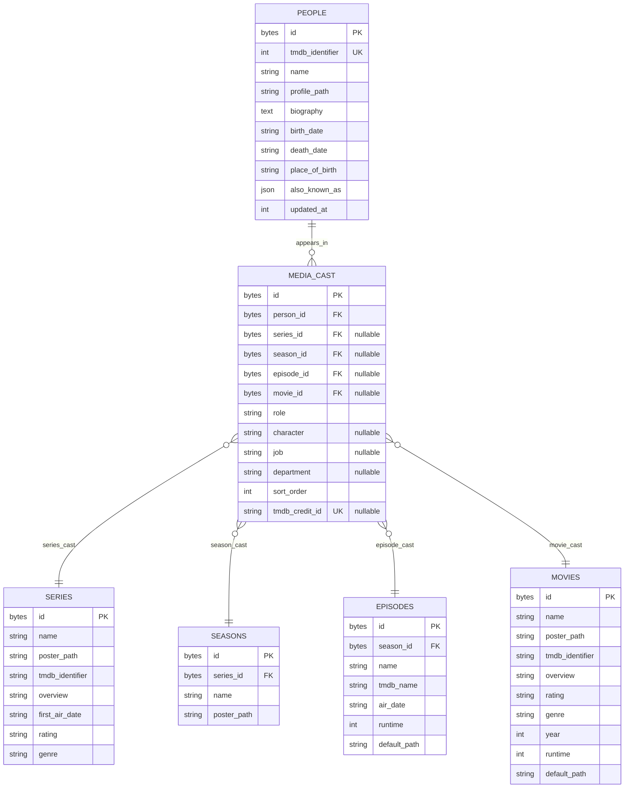

# Metadata Enhancement Architecture

## Overview

This document outlines the architecture for enhancing LAN Streamer's metadata system to support:

1. **Cast & Crew** — Actors, Directors, Writers, Producers stored in a normalized schema with relationships to Series, Seasons, Episodes, and Movies
2. **Poster Selection** — Choosing from multiple poster variants for series and movies
3. **Reorganized Detail Pages** — Series, Season, Episode, and Movie detail views redesigned to showcase people metadata
4. **Cast Detail Page** — A new view showing a person's biography and complete filmography

---

## 1. Database Schema Design

### 1.1 New Tables

#### `people`

| Column | Type | Constraints | Description |
|---|---|---|---|
| `id` | `UUIDBLOB` (str) | PK, default `_new_uuid_str()` | Primary key |
| `tmdb_identifier` | `Integer` | Unique, nullable | TMDB person ID |
| `name` | `String(255)` | NOT NULL | Display name |
| `profile_path` | `String(512)` | Nullable | Local cached profile photo path |
| `biography` | `Text` | Nullable | Full biography from TMDB |
| `birth_date` | `String(10)` | Nullable | YYYY-MM-DD format |
| `death_date` | `String(10)` | Nullable | YYYY-MM-DD format |
| `place_of_birth` | `String(255)` | Nullable | Birthplace |
| `also_known_as` | `JSON` | Nullable | Alternative names |
| `updated_at` | `Integer` | NOT NULL, default `0` | Unix timestamp for cache invalidation |

**Indexes:**
- `idx_people_tmdb_identifier` on `(tmdb_identifier)` — UNIQUE
- `idx_people_name` on `(name)`
- `idx_people_name_trigram` on `(name)` — for fuzzy search (SQLite FTS5 would be even better)

#### `media_cast` (Polymorphic Association)

| Column | Type | Constraints | Description |
|---|---|---|---|
| `id` | `UUIDBLOB` (str) | PK, default `_new_uuid_str()` | Primary key |
| `person_id` | `UUIDBLOB` (str) | FK -> `people.id ON DELETE CASCADE`, NOT NULL | Reference to person |
| `series_id` | `UUIDBLOB` (str) | FK -> `series.id ON DELETE CASCADE`, nullable | For series-level crew |
| `season_id` | `UUIDBLOB` (str) | FK -> `seasons.id ON DELETE CASCADE`, nullable | For season-level crew |
| `episode_id` | `UUIDBLOB` (str) | FK -> `episodes.id ON DELETE CASCADE`, nullable | For episode guest stars |
| `movie_id` | `UUIDBLOB` (str) | FK -> `movies.id ON DELETE CASCADE`, nullable | For movie cast/crew |
| `role` | `String(50)` | NOT NULL | `"actor"`, `"director"`, `"writer"`, `"producer"`, `"guest_star"` |
| `character` | `String(255)` | Nullable | Character name (for actors) |
| `job` | `String(255)` | Nullable | Specific job title (e.g. "Executive Producer") |
| `department` | `String(50)` | Nullable | TMDB department (e.g. "Acting", "Directing") |
| `sort_order` | `Integer` | NOT NULL, default `0` | Display ordering (TMDB cast_order) |
| `tmdb_credit_id` | `String(50)` | Nullable, unique | TMDB credit ID for deduplication |

**Constraints:**
- CHECK: exactly one of `series_id`, `season_id`, `episode_id`, `movie_id` must be non-NULL (polymorphic constraint)
- UNIQUE: `(person_id, series_id, role, tmdb_credit_id)` — prevent duplicate credits
- UNIQUE: `(person_id, movie_id, role, tmdb_credit_id)` — prevent duplicate credits

**Indexes:**
- `idx_media_cast_person` on `(person_id)`
- `idx_media_cast_series` on `(series_id)`
- `idx_media_cast_season` on `(season_id)`
- `idx_media_cast_episode` on `(episode_id)`
- `idx_media_cast_movie` on `(movie_id)`
- `idx_media_cast_role` on `(role)`

### 1.2 Schema Diagram (Mermaid)



### 1.3 Poster Storage Enhancement

Currently, `poster_path` stores a single local filesystem path. To support poster selection, we introduce a new table:

#### `media_images`

| Column | Type | Constraints | Description |
|---|---|---|---|
| `id` | `UUIDBLOB` (str) | PK | Primary key |
| `series_id` | `UUIDBLOB` (str) | FK -> `series.id`, nullable | For series posters |
| `movie_id` | `UUIDBLOB` (str) | FK -> `movies.id`, nullable | For movie posters |
| `image_type` | `String(20)` | NOT NULL | `"poster"`, `"backdrop"`, `"logo"` |
| `source` | `String(10)` | NOT NULL | `"tmdb"`, `"local"`, `"url"` |
| `url` | `String(512)` | Nullable | Source URL (TMDB or custom) |
| `local_path` | `String(512)` | Nullable | Cached local path |
| `is_selected` | `Boolean` | NOT NULL, default `False` | Currently active poster |
| `sort_order` | `Integer` | NOT NULL, default `0` | Display order |
| `width` | `Integer` | Nullable | Image width |
| `height` | `Integer` | Nullable | Image height |
| `language` | `String(10)` | Nullable | Language code |

**Indexes:**
- `idx_media_images_series` on `(series_id)`
- `idx_media_images_movie` on `(movie_id)`
- `idx_media_images_type` on `(image_type)`

When multiple posters exist, the one with `is_selected=True` is used. Poster selection UI allows browsing all available `media_images` entries and setting one as selected.

### 1.4 Relationship Summary

```
Person (1) ──< MediaCast (N) >── Series (0..1)
                                    Season (0..1)
                                    Episode (0..1)
                                    Movie (0..1)

Series (1) ──< MediaImages (N)  (posters/backdrops)
Movie (1)  ──< MediaImages (N)  (posters/backdrops)
```

---

## 2. Data Flow

### 2.1 Cast Data Acquisition During Scan

```
TMDB API Call (per series/movie)
    │
    ├── GET /tv/{id}/credits
    │       └── Returns: cast[], crew[]
    │           └── For each person:
    │               ├── Person already exists in DB?
    │               │   ├── Yes → Use existing Person ID
    │               │   └── No  → Create new Person record
    │               └── Create MediaCast record
    │
    ├── GET /movie/{id}/credits
    │       └── Same pattern as above
    │
    └── GET /tv/{id}/season/{n}/episode/{m}/credits
            └── Same pattern (per-episode guest stars)
```

### 2.2 Flow Details

1. **Scan Phase**: During metadata resolution in `metadata_series.py` and `metadata_movie.py`, after resolving basic TMDB info, call a new function `fetch_and_store_credits()` that runs in a background worker.

2. **Person Deduplication**: Before creating a new Person, check by `tmdb_identifier`. If a person with the same TMDB ID exists, reuse the existing record. Update fields like `profile_path`, `biography` if stale.

3. **Credit Deduplication**: Use `tmdb_credit_id` to prevent duplicate MediaCast entries for the same person+media+role combination.

4. **Profile Photo Caching**: Same pattern as poster caching — download to `~/.config/lan-streamer/cache/people/{tmdb_id}.jpg`.

### 2.3 Display Flow

```
UI Request (series detail page)
    │
    └── Query: MediaCast where series_id = X
            │
            ├── Group by role:
            │   ├── role="actor" → "Cast" section, ordered by sort_order
            │   ├── role="director" → "Directed by" section
            │   ├── role="writer" → "Written by" section
            │   └── role="producer" → "Produced by" section
            │
            └── For each MediaCast, join Person for:
                ├── name
                ├── profile_path
                └── character (for actors)
```

### 2.4 Cast Detail Page Resolution

When clicking on a person:

```
Person ID → Query MediaCast WHERE person_id = X
    │
    ├── For each media_cast record:
    │   ├── If series_id IS NOT NULL → join Series → show series name
    │   ├── If season_id IS NOT NULL → join Season + Series
    │   ├── If episode_id IS NOT NULL → join Episode + Season + Series
    │   └── If movie_id  IS NOT NULL → join Movie → show movie name
    │
    └── Group by role for display sections:
        ├── "Appears In" (actor/guest_star roles)
        ├── "Directed" (director roles)
        ├── "Written" (writer roles)
        └── "Produced" (producer roles)
```

---

## 3. UI Layout Options

Three visual design options are presented for the reorganized detail pages.

### Option A: "Jellyfin Inspired" — Left Sidebar + Content Panel

```
┌──────────────────────────────────────────────────────┐
│ ┌──────────┐  ┌────────────────────────────────────┐ │
│ │          │  │  Series Name                        │ │
│ │  POSTER  │  │  Year · Seasons · Rating            │ │
│ │          │  │  ┌────────────────────────────────┐ │ │
│ │          │  │  │  OVERVIEW TEXT...               │ │ │
│ │          │  │  └────────────────────────────────┘ │ │
│ │          │  │                                      │ │
│ │  [Change]│  │  ─── Cast ───                        │ │
│ │          │  │  ┌────┐┌────┐┌────┐┌────┐┌────┐   │ │
│ │          │  │  │Name│ │Name│ │Name│ │Name│ │Name│   │ │
│ │          │  │  │Char│ │Char│ │Char│ │Char│ │Char│   │ │
│ └──────────┘  │  └────┘└────┘└────┘└────┘└────┘   │ │
│               │                                      │ │
│               │  ─── Crew ───                         │ │
│               │  Directed by: Name · Written by: Name │ │
│               │                                      │ │
│               │  ┌─ Season 1 ─┬─ Season 2 ─┬─ Season 3 ┐ │
│               │  │ Ep 1       │ Ep 1       │ Ep 1      │ │
│               │  │ Ep 2       │ Ep 2       │ Ep 2      │ │
│               │  │ ...        │ ...        │ ...       │ │
│               │  └────────────┴────────────┴───────────┘ │
│               └────────────────────────────────────┘ │
└──────────────────────────────────────────────────────┘
```

**Characteristics:**
- Fixed-width poster panel on the left (like Jellyfin's detail view)
- Poster has a "Change" button overlay for poster selection
- Content flows vertically on the right: title metadata → overview → cast grid → crew list → seasons
- Cast displayed as a horizontal scrollable grid of profile photos + name + character
- Seasons as tabs or an accordion below the cast section

### Option B: "Plex Inspired" — Hero Header + Scroll

```
┌──────────────────────────────────────────────────────────┐
│ ┌──────────────────────────────────────────────────────┐ │
│ │                                                        │ │
│ │              ┌─────────────┐                           │ │
│ │              │             │                           │ │
│ │   Backdrop   │   POSTER    │  SERIES NAME              │ │
│ │   Image      │             │  Year · Seasons · Rating  │ │
│ │              │             │  Director: Name           │ │
│ │              │             │  Writers: Name, Name      │ │
│ │              └─────────────┘                           │ │
│ │                  [Play] [Trailer]                      │ │
│ └──────────────────────────────────────────────────────┘ │
│                                                           │
│ ─── Overview ───                                          │
│ A long-running series about...                            │
│                                                           │
│ ─── Cast ───                                              │
│ ┌──────┐ ┌──────┐ ┌──────┐ ┌──────┐ ┌──────┐ ┌──────┐ │
│ │      │ │      │ │      │ │      │ │      │ │      │ │
│ │Photo │ │Photo │ │Photo │ │Photo │ │Photo │ │Photo │ │
│ │Name  │ │Name  │ │Name  │ │Name  │ │Name  │ │Name  │ │
│ │Char  │ │Char  │ │Char  │ │Char  │ │Char  │ │Char  │ │
│ └──────┘ └──────┘ └──────┘ └──────┘ └──────┘ └──────┘ │
│                                                           │
│ ─── Seasons ───                                           │
│ ┌──────────────────────────────────────────────────────┐ │
│ │ Season 1 (13 Episodes)                     [▶ Play] │ │
│ │ ───────────────────────────────────────────          │ │
│ │ S01E01 · Episode Name                    ● Watched  │ │
│ │ S01E02 · Episode Name                    ● Unwatched│ │
│ │ ...                                                 │ │
│ └──────────────────────────────────────────────────────┘ │
│ ┌──────────────────────────────────────────────────────┐ │
│ │ Season 2 (10 Episodes)                     [▶ Play] │ │
│ │ ...                                                  │ │
│ └──────────────────────────────────────────────────────┘ │
└──────────────────────────────────────────────────────────┘
```

**Characteristics:**
- Full-width hero header with backdrop image (when available), poster overlaid
- Key metadata upfront (title, year, rating, director, writers)
- Play/Trailer buttons in the hero area
- Content sections scroll vertically: overview → cast grid → season accordion
- Each season is a collapsible card with episode list
- Clean, media-centric aesthetic

### Option C: "Hybrid Tab-Based" — Tab Navigation + Details

```
┌──────────────────────────────────────────────────────────┐
│ ┌──────────┐  ┌────────────────────────────────────────┐ │
│ │          │  │  Series Name              [Play] [⋮]   │ │
│ │  POSTER  │  │  Year · Seasons · Rating               │ │
│ │          │  │                                          │
│ │          │  │  [ Overview ] [ Cast ] [ Seasons ] [ More] │
│ │          │  │  ┌────────────────────────────────────┐ │ │
│ │          │  │  │  OVERVIEW TAB (default)             │ │ │
│ │ [Change] │  │  │  Full overview text                 │ │ │
│ │          │  │  │                                     │ │ │
│ │          │  │  │  ─── Crew ───                       │ │ │
│ │          │  │  │  Director: Name                     │ │ │
│ │          │  │  │  Writers: Name, Name                │ │ │
│ │          │  │  │  Producers: Name, Name              │ │ │
│ └──────────┘  │  └────────────────────────────────────┘ │ │
│               │                                          │
│               │  ┌────────────────────────────────────┐ │ │
│               │  │  CAST TAB                           │ │ │
│               │  │  ┌────┐┌────┐┌────┐┌────┐┌────┐   │ │ │
│               │  │  │Name│ │Name│ │Name│ │Name│ │Name│   │ │ │
│               │  │  │Char│ │Char│ │Char│ │Char│ │Char│   │ │ │
│               │  │  └────┘└────┘└────┘└────┘└────┘   │ │ │
│               │  └────────────────────────────────────┘ │ │
│               │                                          │
│               │  ┌────────────────────────────────────┐ │ │
│               │  │  SEASONS TAB                        │ │ │
│               │  │  Season 1 · Season 2 · Season 3     │ │ │
│               │  │  Sub-tabs for each season           │ │ │
│               │  │  Episode list in selected season    │ │ │
│               │  └────────────────────────────────────┘ │ │
│               └────────────────────────────────────────┘ │
└──────────────────────────────────────────────────────────┘
```

**Characteristics:**
- Fixed poster on the left with "Change" overlay
- Tab bar: Overview | Cast | Seasons | More (Metadata, Files)
- Overview tab shows plot + crew (director, writers, producers as a list)
- Cast tab shows the full cast grid with photos, names, characters
- Seasons tab shows season sub-tabs with episode tables
- "More" tab could contain file info, technical details, settings (current dialog contents)
- Familiar tab-based navigation, easy to extend

---

## 4. Season Detail Page Options

### Option A (Jellyfin Style — Inline Season Panel)
```
────────────── Season 1 ─────────────────
┌──────┐  Director: Name
│Poster│  Writers: Name, Name
│      │  Guest Stars: Name, Name
│8.5/10│
└──────┘
┌────┬────────────────────┬──────────┬─────────┬──────┐
│ #  │ Title              │ Air Date │ Runtime │ ...  │
├────┼────────────────────┼──────────┼─────────┼──────┤
│ 1  │ Episode Name       │ 2024-01-01│ 45 min  │ [⋮]  │
└────┴────────────────────┴──────────┴─────────┴──────┘
```

### Option B (Plex Style — Season Card)
```
┌─────────────────────────────────────────────────┐
│ Season 1 (13 Episodes)                          │
│ ┌──────┐ ┌──────┐ ┌──────┐ ┌──────┐ ┌──────┐  │
│ │      │ │      │ │      │ │      │ │      │  │
│ │Poster│ │Poster│ │Poster│ │Poster│ │Poster│  │
│ │Ep 1  │ │Ep 2  │ │Ep 3  │ │Ep 4  │ │Ep 5  │  │
│ └──────┘ └──────┘ └──────┘ └──────┘ └──────┘  │
│ Director: Name · Writers: Name, Name            │
└─────────────────────────────────────────────────┘
```

---

## 5. Cast Detail Page Design

```
┌──────────────────────────────────────────────────────┐
│ ┌──────────┐  ┌────────────────────────────────────┐ │
│ │          │  │  PERSON NAME                        │ │
│ │  Photo   │  │  Actor · Director · Writer          │ │
│ │          │  │  Born: Jan 1, 1970 in Somewhere     │ │
│ │          │  │                                      │ │
│ │          │  │  ─── Biography ───                   │ │
│ │          │  │  Full biography text from TMDB...    │ │
│ └──────────┘  │                                      │ │
│               │  ─── Filmography ───                  │ │
│               │                                      │ │
│               │  [Series] [Movies] [All]             │ │
│               │                                      │ │
│               │  ┌─ Series Name ─────────────────┐   │ │
│               │  │  Role: Character (Actor)      │   │ │
│               │  │  Seasons: 1-5 · 50 Episodes   │   │ │
│               │  │  [View Series]                │   │ │
│               │  └───────────────────────────────┘   │ │
│               │                                      │ │
│               │  ┌─ Movie Name ──────────────────┐   │ │
│               │  │  Role: Character (Actor)       │   │ │
│               │  │  Year: 2023 · 2h 15m          │   │ │
│               │  │  [View Movie]                 │   │ │
│               │  └───────────────────────────────┘   │ │
│               └────────────────────────────────────┘ │
└──────────────────────────────────────────────────────┘
```

**Key Features:**
- Profile photo + name + list of roles (e.g. "Actor, Director")
- Birth/death info + birthplace
- Biography section (scrollable)
- Filmography grouped by media type (Series/Movies) with filter tabs
- Each entry shows: media title, role/character, year info
- Clicking an entry navigates to the media's detail page

---

## 6. Implementation Plan

### Phase 1: Database Schema (Estimated: 1-2 commits)
1. Add `Person` model to `db/models.py`
2. Add `MediaCast` model to `db/models.py`
3. Add `MediaImage` model to `db/models.py`
4. Create Alembic migration revision
5. Add relationship helpers on existing models (Series.cast, Movie.cast, Person.filmography)
6. Write DB query functions in new `db/queries_cast.py`
7. Write tests for models and queries

### Phase 2: TMDB Credits Integration (Estimated: 1-2 commits)
1. Add `get_series_credits()`, `get_movie_credits()`, `get_episode_credits()` methods to TMDB client
2. Add `get_person_details()` method to TMDB client
3. Create `services/metadata_cast.py` with:
   - `fetch_and_store_series_credits()` — fetches + deduplicates + stores cast for a series
   - `fetch_and_store_movie_credits()` — same for movies
   - `fetch_and_store_episode_credits()` — same for episodes
   - `resolve_person_profile()` — downloads and caches profile photos
4. Integrate credit fetching into the scan pipeline (`metadata_series.py` and `metadata_movie.py`)
5. Write tests

### Phase 3: Poster Selection System (Estimated: 1 commit)
1. Implement DB queries for `media_images` (get all posters for a series/movie, set selected, add/remove)
2. Add TMDB methods to fetch alternative poster URLs (`/tv/{id}/images`, `/movie/{id}/images`)
3. Create `services/metadata_images.py` for poster fetching during scan
4. Add poster selection UI as a dialog or inline widget:
   - Thumbnail grid of available posters
   - Click to select (sets `is_selected=True`, all others `False`)
   - Option to upload local image

### Phase 4: Detail Page UI Reorganization (Estimated: 2-3 commits)
1. Redesign `SeriesDetailView` with cast grid, crew list, reorganized season layout
2. Add `SeasonDetailView` (new full-page view or inline enhancement)
3. Enhance `MovieDetailView` with cast/crew sections
4. Update `EpisodeDetailsDialog` to show guest cast, director, writer
5. Choose one of the three layout options (A, B, or C)
6. Add poster selection button/overlay to detail views
7. Write UI tests

### Phase 5: Cast Detail Page (Estimated: 1-2 commits)
1. Create `ui_views/cast_detail.py` with `CastDetailView(QWidget)`
2. Add controller signals: `cast_member_selected(person_id)`
3. Wire navigation: clicking a cast member in any detail view → CastDetailView
4. Implement filmography resolution (query MediaCast + joined media tables)
5. Add person data refresh from TMDB
6. Write tests

---

## 7. File Organization Plan

### New files to create:
```
src/lan_streamer/
  db/
    queries_cast.py          # Cast/crew DB queries
    models_cast.py           # Person, MediaCast, MediaImage models
  services/
    metadata_cast.py         # TMDB credits fetching + storage
    metadata_images.py       # Poster selection + image management
  ui_views/
    cast_detail.py           # CastDetailView widget
    detail_pages/            # (optional) subpackage for redesigned detail views
      series_detail.py       # Redesigned SeriesDetailView
      movie_detail.py        # Redesigned MovieDetailView
      season_detail.py       # New SeasonDetailView
    dialogs/
      poster_selector.py     # Poster selection dialog
tests/
  unit/db/
    test_queries_cast.py     # Tests for cast queries
    test_models_cast.py      # Tests for new models
  unit/services/
    test_metadata_cast.py    # Tests for cast metadata
    test_metadata_images.py  # Tests for images
  unit/ui_views/
    test_cast_detail.py      # Tests for cast detail view
    dialogs/
      test_poster_selector.py # Tests for poster selector
```

### Existing files to modify:
```
src/lan_streamer/db/models.py              # Add relationships to existing models
src/lan_streamer/db/__init__.py             # Export new query functions
src/lan_streamer/providers/tmdb.py          # Add credit endpoints
src/lan_streamer/providers/tmdb_async.py    # Add credit endpoints (async)
src/lan_streamer/services/metadata_series.py # Integrate credit fetching
src/lan_streamer/services/metadata_movie.py  # Integrate credit fetching
src/lan_streamer/ui_views/__init__.py       # Export new views
src/lan_streamer/ui_views/controller.py     # Add new signals + slots
src/lan_streamer/ui_views/series_detail.py  # Redesign with cast
src/lan_streamer/ui_views/movie_detail.py   # Redesign with cast
src/lan_streamer/ui_views/library_grid.py   # Navigate to cast detail
src/lan_streamer/main.py                    # Register new views
```

---

## 8. Migration Strategy

### Migration Approach
- New revision at version `0.39.0` (matching current `__version__`)
- Create three new tables: `people`, `media_cast`, `media_images`
- Add indexes on FK columns for query performance
- Drop `rating` and `genre` columns from `Series` table (add them if needed in future)
- No data loss — existing data is preserved

### Rollback
- Downgrade drops the three new tables
- No existing data is affected

---

## 9. Testing Strategy

### Person Model Tests
- Create person with required and optional fields
- Test unique constraint on `tmdb_identifier`
- Test cascade delete behavior

### MediaCast Model Tests
- Create cast entries for all media types (series, season, episode, movie)
- Test polymorphic constraint (exactly one FK)
- Test unique constraint on (person_id + media + role)
- Test cascade delete when referenced media is deleted

### TMDB Credits Tests
- Mock TMDB API responses for `/tv/{id}/credits`
- Test person deduplication logic
- Test credit deduplication via `tmdb_credit_id`
- Test profile photo caching

### UI Tests
- Test that cast grid renders on series detail page
- Test navigation from cast member → cast detail page
- Test poster selection dialog opens and saves
- Test filmography display on cast detail page

---

## 10. Design Decisions (Selected)

The following decisions have been made and form the basis of the implementation plan:

| Decision | Choice | Rationale |
|---|---|---|
| **UI Layout** | Option A — Jellyfin Inspired | Sidebar poster + vertical scroll content with sections for cast grid, crew, and seasons. Familiar, clean separation. |
| **Season Display** | Both — inline + dedicated view | Inline collapsible panels in SeriesDetailView + dedicated SeasonDetailView page accessible via button. |
| **Episode Credits** | Batch-fetch during scan | Fetch all episode credits during library scan. More API calls but all data available offline. |
| **Backdrop Images** | Included now | Fetch and store backdrops alongside posters. Required for the Jellyfin-style layout's visual appeal. |
| **Poster Selection** | Dialog with thumbnail grid | Modal dialog showing all available poster images as selectable thumbnails. |
| **Episode-Level Credits** | Batch-fetch during scan | All episode credits fetched during initial scan; stored in media_cast table. |

## 11. Open Questions / Future Enhancements

1. **Offline Mode**: When cast detail page is accessed offline, use cached Person data. TMDB refresh should be a manual action.
2. **Search**: Should the SearchDialog include people in results? Yes — as a follow-up enhancement.
3. **Backdrop Hero**: The Jellyfin-inspired layout can still show a backdrop in the header area above the poster. Consider this as a visual enhancement in Phase 5.
